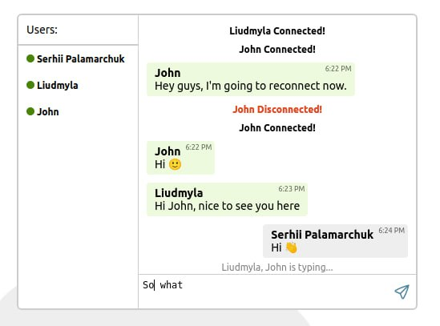
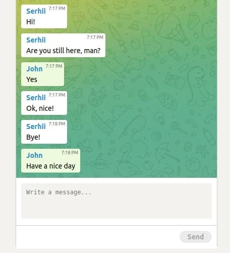
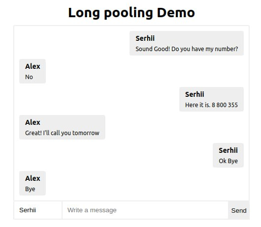

# JavaScript Demos

My hands-on and demo works related to **Node.js**, **Vue**, **React**, **Angular**, **JS** , **TS** and other X technologies.

Demo                       | Description             	                                                                                                                                                                             | Screenshot    
----------------------------------|-------------------------------------------------------------------------------------------------------------------------------------------------------------------------------------------------------|----------------------------------------
**[Socket](https://github.com/palamarchukser/demos/tree/master/socket)** | Demo Chat with sounds notifications, links parser, active users list, connected/dissconnected and typing states using **Socket.IO**, **Angular**, **JavaScript**, **TypeScript**, **HTML**, **SCSS**. | 
**[Server-Sent Events](https://github.com/palamarchukser/demos/tree/master/server-sent)** | Server-Sent Events demo using **Node.js**, **Express**, **React**, **Typescript**                                                                                                                     | 
**[HTTP Long Polling](https://github.com/palamarchukser/demos/tree/master/long-pooling)** | Small Long Pooling demo using **Node**, **Express**, **Vue**, **Typescript**.                                                                                                                         | 
